# Codebase Genius — AI Documentation Agent (Jac Edition)

An autonomous tool that ingests a GitHub repository and generates a clean repo map, README summaries, and a basic code analysis — all written into the `docs/` folder.

**Agent loop:** *Perceive → Plan/Think → Act*  
Perceive (read files) → Plan (decide what to document) → Act (write Markdown/JSON, call tools)

---

##  What it does (MVP)

- **Use local repo or shallow‑clone** a repo for speed.  
- **Repo Map**: file walker → `docs/map.json`.  
- **README Summaries**: extract headings and summarize → `docs/readme_summaries.json`.  
- **Code Analysis (Python focus)**: list functions/classes/imports → `docs/analysis.json`.  
- **Docs Index**: minimal landing page → `docs/index.md`.

---

##  Architecture (Agents)

- **Supervisor** — orchestrates the pipeline.  
- **Repo Mapper** — builds high‑level map (optionally .gitignore‑aware).  
- **README Summarizer** — section skeleton + decreasing‑percentage summaries.  
- **Code Analyzer** — Python AST: functions/classes/imports.  
- **DocGenie** — writes `docs/index.md` tying everything together.

```mermaid
flowchart LR
  A[CLI: ui/cli.jac] --> B[Supervisor]
  B --> C[tools/git_tools.iter_*]
  B --> D[Repo Mapper → docs/map.json]
  B --> E[README Summarizer → docs/readme_summaries.json]
  B --> F[Code Analyzer → docs/analysis.json]
  B --> G[DocGenie → docs/index.md]
```



---

##  Requirements

- **Git**
- **JacLang CLI** (`jac`) – install via:
  ```bash
  pip install jaclang
  ```
- (Optional, for Python analysis & local dev) **Python 3.11+** and:
  ```bash
  pip install pathspec networkx rich markdownify
  ```

> Tip: Set your editor to **UTF‑8 (no BOM)** to avoid parse errors.

---

##  Quick Start

### Windows (PowerShell)

```powershell
# 1) Clone your tool
git clone https://github.com/<you>/codebase-genius-jac.git
cd codebase-genius-jac

# 2) (Optional) Python deps if you want Python AST analysis
python -m venv .venv
. .\.venv\Scripts\Activate.ps1
pip install pathspec networkx rich markdownify

# 3) Run on a small public repo (example)
jac run tests\self_check.jac
# or directly call your entry if you have one, e.g.:
# jac run ui/cli.jac -- https://github.com/pallets/click
```

### macOS / Linux

```bash
git clone https://github.com/<you>/codebase-genius-jac.git
cd codebase-genius-jac

# Optional Python deps
python -m venv .venv
source .venv/bin/activate
pip install pathspec networkx rich markdownify

# Run
jac run tests/self_check.jac
# or: jac run ui/cli.jac -- https://github.com/pallets/click
```

**Run on the current project (no clone):**
```bash
jac run ui/cli.jac -- .
```

---

## Output Files (in `docs/`)

- `map.json` — high‑level file map  
- `readme_summaries.json` — headings + summarized sections  
- `analysis.json` — Python functions/classes/imports (if any)  
- `index.md` — minimal index page linking the above

---

## Folder Structure (Jac)

```
codebase-genius/
  agents/
    supervisor.jac
    repo_mapper.jac
    code_analyzer.jac
    docgenie.jac
    __init__.jac
  tools/
    git_tools.jac
    fs_tools.jac
    summarizer.jac
    __init__.jac
  ui/
    cli.jac
    __init__.jac
  tests/
    self_check.jac
    __init__.jac
  docs/              # generated outputs (safe to commit or ignore)
  .gitignore
  README.md
```

**Recommended `.gitignore`:**
```
.venv/
__pycache__/
workspace/
docs/*.json
```

---

##  Self‑Check (Optional)

Run a small automated test to confirm everything works:

```bash
jac run tests/self_check.jac
```


## 🗺️ Roadmap

- Mermaid import/call graphs in `Architecture.md`  
- Multi‑language parsing (Tree‑sitter)  
- Rich HTML documentation output  
- Parallel agents for speed  

---
